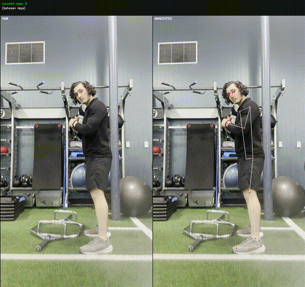
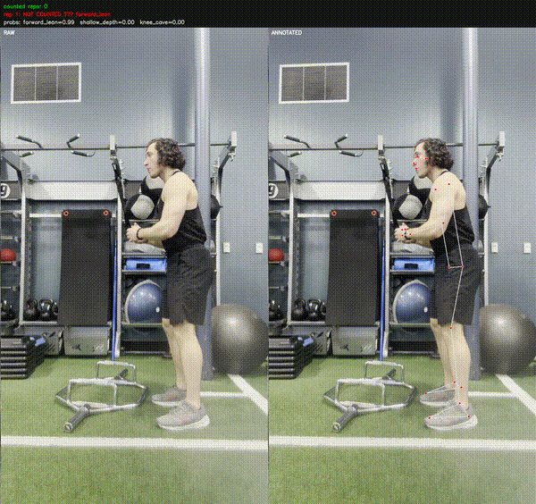

# SquatCoach

Per-rep squat form assessment and intelligent rep counting from a single video. MediaPipe-based pose estimation → rep segmentation → biomechanical feature extraction → multi-label ML classifier → side-by-side annotated video with live verdicts.

**A rep only counts if the form passes.** Videos contain multiple reps (3–5 each); each rep is judged independently against three common faults: **forward lean**, **shallow depth**, and **knee cave**.

<table>
  <tr>
    <td align="center"><b>Good form — 5/5 counted</b></td>
    <td align="center"><b>Forward lean — 0/4 counted</b></td>
  </tr>
  <tr>
    <td></td>
    <td></td>
  </tr>
</table>

---

## Results (leave-one-video-out CV on 12 labeled clips, 41 reps)

| Fault | Rule-based F1 | ML F1 (RF, aug=8) |
|---|---|---|
| forward_lean | 0.88 | 0.80 |
| shallow_depth | 0.69 | **1.00** |
| knee_cave | 0.35 | **0.80** |
| **counted_valid** | 0.67 | **0.95** |

The rule-based baseline is competitive on forward lean (clean one-feature signal) but fails on knee cave, where the view-dependent geometry requires a learned combination of features. With 8× augmentation per training rep (horizontal mirror, time warp, landmark jitter, small affine), the Random Forest reaches 0.95 F1 on the top-line "did this rep count?" metric.

---

## Pipeline

```
video → pose.py ────────────────► (T, 33, 4) landmark tensor (cached)
         │                          │
         ▼                          ▼
      RotatingCapture           segment.py  ─── per-rep (start, bottom, end)
      (fixes iPhone
       rotation metadata)           │
                                    ▼
                              features.py ───► 15-dim biomech feature vector
                                    │           (depth, lean, valgus delta,
                                    │            tempo, symmetry, view score)
                                    ▼
                              ┌─────┴─────┐
                        rules.py     model.py (sklearn, multi-label)
                        thresholds   augment.py: mirror, time-warp, jitter,
                                     dropout → 8× training data
                                    │
                                    ▼
                            evaluate.py — LOVO-CV: train folds augmented,
                                          test fold is raw video only
                                    │
                                    ▼
                            annotate_video.py — side-by-side output with
                                                live rep count + verdict
                                    │
                                    ▼
                            batch.py — processes all clips, writes
                                       results/squat_reps.csv +
                                       results/annotated/*.mp4
```

---

## Quick start

```bash
# Setup
python3 -m venv form_env && source form_env/bin/activate
pip install -r requirements.txt

# One-shot: segment a video and print detected reps
python -m src.main segment --video data/raw/squats/good/squat_good_side_01.mov

# Run LOVO-CV evaluation (rule vs ML) and write results/report.md
python -m src.evaluate --estimator rf --augment 8

# Train the final model + batch-annotate all 12 clips
python -m src.batch --train --model rf
```

Outputs land in:
- `results/report.md`, `results/metrics.json` — evaluation
- `results/annotated/*.mp4` — side-by-side annotated videos
- `results/squat_reps.csv` — one row per rep (counted / faults / probabilities)
- `models/squat_multilabel_rf.pkl` — trained model

---

## Repo layout

```
src/
├── pose.py             MediaPipe extraction, NPZ-cached to data/interim/poses/
├── video_io.py         RotatingCapture — applies video rotation metadata
├── segment.py          Knee-angle Savitzky-Golay + peak-find → per-rep windows
├── augment.py          Landmark-sequence augmentations (mirror, warp, jitter, …)
├── features.py         15-dim per-rep feature vector + dataset builder
├── rules.py            Interpretable rule-based classifier (baseline)
├── model.py            Multi-label sklearn classifier (LogReg / RandomForest)
├── evaluate.py         Leave-one-video-out CV, writes report.md + metrics.json
├── annotate_video.py   Side-by-side RAW | ANNOTATED video with live HUD
├── annotate_reps.py    Interactive per-rep labeling tool
├── batch.py            End-to-end orchestrator over all clips
├── squat.py            Legacy whole-video analyzer (kept for reference)
├── main.py             CLI: analyze | segment
└── utils.py            MediaPipe drawing helpers, geometry
data/
├── raw/squats/{good,bad}/*.mov     12 self-filmed clips (3 side + 9 front etc.)
├── interim/poses/*.npz             Cached landmark sequences
├── labels/rep_labels.csv           Per-rep ground truth (this is where labels live)
└── ground_truth.csv                Video-level labels (from the original scaffold)
results/
├── annotated/*.mp4                 Side-by-side annotated outputs
├── squat_reps.csv                  Per-rep rollup across all clips
├── metrics.json / report.md        LOVO-CV evaluation artifacts
models/
└── squat_multilabel_rf.pkl         Final trained classifier
```

---

## Design notes

### Why per-rep, not per-video

A set of squats isn't monolithic — one rep can be clean and the next can lose form. Per-video classification hides that. Per-rep:
- matches how a coach evaluates the set
- produces a meaningful "how many of those reps counted?" number
- enables future real-time feedback (mid-set corrections)

### Why leave-one-video-out CV

48 labeled reps split across 12 clips. A random train/test split would leak reps from the same set into both folds: the classifier memorizes the lifter's idiosyncratic geometry (stance width, limb proportions, camera angle) and reports overfit metrics. LOVO forces generalization across subjects/takes — the same discipline you'd want for a production model.

### Why augment landmarks instead of pixels

Feature extraction and rep segmentation already collapse video to a landmark time series, so augmenting at the landmark level is:
- ~1000× cheaper than pixel-level augmentation + re-running pose
- exactly label-preserving for horizontal mirror (swap L/R indices) and time warp (stretch/compress uniformly)
- constrained enough to avoid corrupting labels for small rotations / jitter

Augmentations used: horizontal mirror, time warp ±15%, translation ±3%, scale ±5%, rotation ±3°, Gaussian jitter σ=0.004, 5% frame dropout. Applied only to training folds.

### Why rules + ML side-by-side

Rules are interpretable and reveal feature quality. The rule-based knee-cave F1 of 0.35 is a strong signal that my 2D-projected valgus metric alone isn't enough — the ML model using the same features plus their interactions achieves 0.80. Both ship: `rules.py` for explainable baseline / fallback, `model.py` for the real scoring.

---

## Portfolio notes + roadmap

**Current limitations:**
- 12 clips from one lifter — the model has not seen different body types
- No real-time / webcam mode (batch only)
- Knee-cave detection is view-dependent (requires a front-facing camera)
- Form labels only cover 3 fault types

**Natural next steps:**
- Collect more clips (more lifters, more camera angles, more fault types — heels rising, butt wink, bar path for barbell squats)
- Swap MediaPipe for an on-device model (MoveNet, BlazePose Lite) and ship a real-time mode
- Per-user calibration: learn each lifter's limb ratios and mobility baseline during a short setup
- Expand to other lifts (deadlift, bench, OHP) — the pose→segment→features→classifier structure generalizes

---

## Requirements

- Python 3.9–3.11
- `mediapipe`, `opencv-python`, `numpy`, `scipy`, `scikit-learn`, `joblib` (see `requirements.txt`)

## License

MIT
